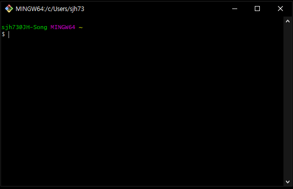
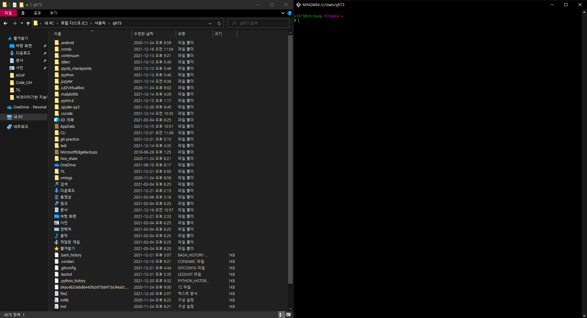

# CLI


## 1. 실습 환경

1. Windows

- Git 설치 후 윈도우 탐색기를 연다. (`윈도우키 + e`)

- `C:/사용자(Users)/현재 사용자 계정` 로 이동.

- 폴더 내 빈 공간에서 마우스 우클릭 후 `Git Bash Here`를 클릭.

- Git Bash 창에 아래 화면처럼 HOME 폴더를 의미하는 `~` 표시만 있다면 정상. (`~` 표시가 없거나, 뒤에 글자가 추가적으로 나타난다면 잘못된 경로.)

  

  

2. Mac

- Git이 기본적으로 내장 되어 있기 때문에, 별도의 설치가 필요 없다.
- Spotlight (검색)를 연다. (화면 우측 상단의 돋보기 혹은 `command + spacebar`)
- `terminal`을 검색하여 터미널을 연다.
- 터미널을 열면 기본적으로 HOME 폴더로 경로가 설정 되어 있다. (`/Users/현재 사용자 계정`)
- `open .`라고 입력하여 HOME 폴더를 연다.


## 2. GUI vs CLI

1. GUI와 CLI의 정의



왼쪽이 GUI, 오른쪽이 CLI이다.

- `GUI(Graphic User Interface)` : 그래픽을 통해 사용자와 컴퓨터가 상호작용하는 방식.
- `CLI(Command Line Interface)` : 터미널을 통해 사용자와 컴퓨터가 상호작용하는 방식.

```
💡 Interface(인터페이스)

인터페이스란 원래 서로 다른 개체끼리 맞닿아 있는 면을 뜻한다.
여기에서는 사용자와 컴퓨터가 서로 소통하는 접점이라고 이해하도록 하자.
```


2. CLI를 사용하는 이유

- `'ABC'`라는 이름의 새로운 폴더를 생성한다고 하면, GUI와 CLI를 사용하는 각 경우는 아래와 같다.
  - GUI를 사용하는 경우 : `마우스 우클릭 > 새로 만들기 > 폴더 > 'ABC'로 이름변경`
  - CLI를 사용하는 경우 : `mkdir ABC` 입력.
- GUI는 CLI에 비해 사용하기 쉽지만 단계가 많고 컴퓨터의 자원을 더 많이 소모한다. 
- CLI는 GUI로는 불가능한 많은 세부적인 기능을 사용할 수 있다.


3. `Git Bash` 사용하기

- Windows에는 CLI 환경인 `powershell`과 `명령 프롬프트`가 이미 존재한다. 
- 그럼에도 불구하고 `Git bash`를 사용하는 이유는, `Git Bash`라는 일종의 번역기를 통해 윈도우 환경에서도 UNIX 계열 운영체제의 터미널 명령어를 사용하기 위함이다. 
- 개발자 입장에서 윈도우보다는 UNIX 계열 운영체제 기반의 프로그램이 훨씬 많지만, 두 명령어 간에는 차이가 존재한다. 
- 따라서 미리 연습을 하기 위해 `Git Bash`를 사용한다.


## 3. 경로

1. 루트, 홈 디렉토리

- 루트 디렉토리(Root directory, `/`)
  - 모든 파일과 폴더를 담고 있는 최상위 폴더.
  - 윈도우의 경우, 보통 `C 드라이브`를 의미한다.
- 홈 디렉토리(Home Directory, `~`)
  - `Tilde(틸드)`라고도 부르며, 현재 로그인 된 사용자의 홈 폴더를 의미한다.
  - Windows의 경우 `C:/사용자(Users)/현재 사용자 계정`을 의미한다.
  - Mac의 경우 `/Users/현재 사용자 계정`을 의미한다.

```
💡 폴더 vs 디렉토리

폴더와 디렉토리는 거의 같은 의미로 사용된다. 따라서 의미의 구분이 무의미하지만, 세부적으로 따지면 윈도우 탐색기에서의 특수 폴더들(ex. 네트워크 환경, 내컴퓨터 등)은 폴더이지만 디렉토리는 아니다. 따라서 폴더가 디렉토리보다 넓은 개념이라고 할 수 있다.
```


2. 절대 경로와 상대 경로

- 절대 경로
  - 루트 디렉토리부터 목적 지점까지 거치는 모든 경로를 전부 작성한 것.
  - 예) `C:/Users/sjh73`
- 상대 경로
  - 현재 작업하고 있는 디렉토리를 기준으로 계산된 상대적 위치를 나타내는 것.
  - `./` : 현재 작업 중인 폴더
  - `../` : 현재 작업 중인 폴더의 상위 폴더


## 4. 터미널 명령어

- `touch`

  - 파일을 생성하는 명령어.

  - 한 번에 여러 개의 파일을 생성할 때는 띄어쓰기로 구분한다.

  - 숨김 파일은 파일명 앞에 `.`을 붙인다.

    ```
    $ touch a.txt b.txt
    ```

- `mkdir`

  - make directory의 약자.

  - 새 폴더를 생성하는 명령어.

  - 파일과 마찬가지로 띄어쓰기로 구분하면 한 번에 여러 개의 폴더를 생성한다.

  - 폴더 이름 내에 공백을 포함하고자 할 때는 `''`으로 폴더명은 감싼다.

    ```
    $ mkdir abc
    $ mkdir 'abc def'
    ```

- `ls`

  - list segments의 약자.

  - 현재 작업 중인 디렉토리의 폴더/파일 목록을 보여주는 명령어.

  - `-a` : all 옵션, 숨김 파일까지 보여준다.

  - `-l` : long 옵션, 파일 정보를 자세히 보여준다.

  - 옵션은 연속적으로 사용 가능하며 축약도 가능하다.

    ```
    $ ls
    $ ls -a
    $ ls -a -l
    $ ls -al
    ```

- `mv`

  - move의 약자.

  - 폴더/파일을 다른 폴더 내로 이동시키거나 이름을 변경하는 명령어.

  - 단, 폴더 이동 시 작성한 폴더가 존재해야 한다. 존재하지 않으면 이름이 바뀐다.

    ```
    $ mv a.txt abc    # mv 파일명 폴더명 > 폴더 이동
    $ mv a.txt c.txt  # mv 파일명 파일명 > 파일명 변경
    ```

- `cd`

  - change directory의 약자.

  - 현재 작업 중인 디렉토리를 변경하는 명령어.

  - 폴더명, 절대 경로, 상대 경로 모두 입력 가능.

  - `cd`, `cd ~` : 홈 디렉토리로 이동.

  -  `cd ..` :  위로 이동.

  - `cd -` : 이전으로 이동.

    ```
    $ cd abc
    $ cd /C:/Users/sjh73
    $ cd ../
    ```

- `rm`

  - remove의 약자.

  - 폴더/파일을 지우는 명령어.

  - 휴지통으로 보내는게 아니라, 완전 삭제한다.

  - `rm *.txt`처럼 파일 확장자 전에 파일명을 `*`로 입력하면 모든 txt 파일을 삭제한다.

  - `-r` : recursive 옵션, 폴더를 지울 때 사용한다.

    ```
    $ rm a.txt
    $ rm -r abc 
    ```

- `start`

  - 폴더/파일을 여는 명령어

  - 맥에서는 `open`가 해당 기능을 수행한다.

    ```
    $ start a.txt
    ```

- 단축키

  - 위/아래 방향키 : 이전 명령어 조회.
  - `tab` : 폴더/파일 이름 자동 완성.
  - `ctrl + a` : 커서 맨 앞으로 이동.
  - `ctrl + e` : 커서 맨 뒤로 이동.
  - `ctrl + w` : 커서 앞 단어 삭제.
  - `ctrl + l` : 터미널 화면 정리.
  - `ctrl + insert` : 복사.
  - `shift + insert` : 붙여넣기.
