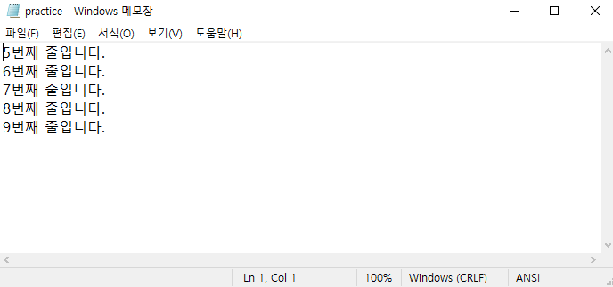
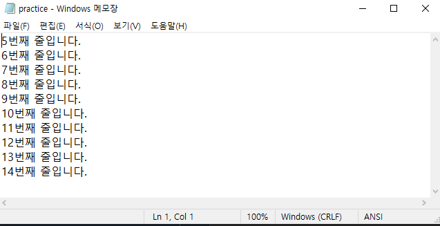
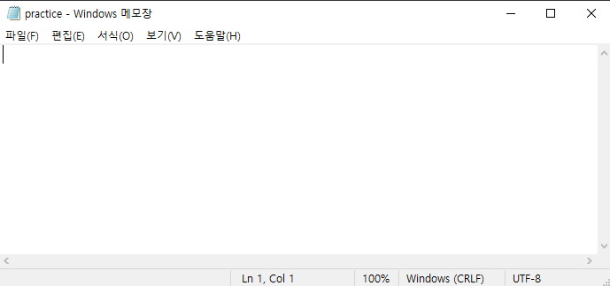

# 4.3. 파일 읽고 쓰기

# 4.3.1. 파일 생성

- 파이썬 내장 함수 `open`은 `‘파일 이름’`과 `‘파일 열기 모드’`를 입력 받고, 파일 객체를 반환한다.
  
    ```python
    f = open('C:/Users/sjh73/Desktop/Code_SJH/practice.txt', 'w')
    # Code_SJH 폴더에 practice.txt 파일을 쓰기 모드로 열기
    f.close()
    # 파일 닫기
    ```
    
- 파일의 생성 위치는 절대 경로와 상대 경로 모두 입력 가능하다.

- 열기 모드의 종류는 아래와 같다.
  
  
    | 파일열기모드 | 설명 |
    | --- | --- |
    | r | 읽기모드 - 파일을 읽기만 할 때 사용 |
    | w | 쓰기모드 - 파일에 내용을 쓸 때 사용 |
    | a | 추가모드 - 파일의 마지막에 새로운 내용을 추가 시킬 때 사용 |
    
- 쓰기 모드로 열 때, 이미 파일이 존재하면 기존 내용이 모두 삭제되며 파일이 존재하지 않으면 새 파일이 생성된다.

# 4.3.2. 파일에 값 적기

- 원하는 데이터를 변수에 지정하고, `f.write(변수)`로 파일에 데이터를 적을 수 있다.

- 생성한 `practice.txt`는 아래와 같이 내용이 없는 상태이다.
  
    
    
- 아래처럼 코드를 입력하고 실행하면, `practice.txt`에 해당 내용이 적힌다.
  
    ```python
    f = open('C:/Users/sjh73/Desktop/Code_SJH/practice.txt', 'w')
    for i in range(5, 10):
        line = "%d번째 줄입니다.\n" % i
        f.write(line)
    f.close()
    ```
    
    
    

# 4.3.3. 파일 읽기

- readline
    - 파일의 한 줄씩 읽고 반환하는 함수
    - 만약 더 이상 읽을 줄이 없다면, 빈 문자열(`’’`)을 반환한다.
    
    ```python
    f = open('C:/Users/sjh73/Desktop/Code_SJH/practice.txt', 'r')
    # 읽기 모드로 파일 열기
    while True:
        line = f.readline()        
        if not line:
    			break
        print(line)           # 파일의 첫 번째 줄을 읽어 출력하되, 더 이상 읽을 줄이 없으면 break
    f.close()
    
    → 5번째 줄입니다.
    
    6번째 줄입니다.
    
    7번째 줄입니다.
    
    8번째 줄입니다.
    
    9번째 줄입니다.
    ```
    
- readlines
    - 파일의 모든 줄을 읽어서 각각의 줄을 요소로 갖는 리스트로 반환하는 함수
      
        ```python
        f = open('C:/Users/sjh73/Desktop/Code_SJH/practice.txt', 'r')
        lines = f.readlines()
        for line in lines:
            line = line.strip('\n')  # 줄 끝의 줄 바꿈 문자 제거
            print(line)
        f.close()
        
        → 5번째 줄입니다.
        6번째 줄입니다.
        7번째 줄입니다.
        8번째 줄입니다.
        9번째 줄입니다.
        
        ```
    
- read
    - 파일의 전체를 문자열로 반환한다.
      
        ```python
        f = open('C:/Users/sjh73/Desktop/Code_SJH/practice.txt', 'r')
        data = f.read()
        print(data)
        f.close()
        
        → 5번째 줄입니다.
        6번째 줄입니다.
        7번째 줄입니다.
        8번째 줄입니다.
        9번째 줄입니다.
        ```
        

# 4.3.4. 파일에 내용 추가

- 추가 모드(`'a'`)로 열어 추가할 내용을 입력한다.
  
    ```python
    f = open('C:/Users/sjh73/Desktop/Code_SJH/practice.txt', 'a')
    for i in range(10, 15):
        data = "%d번째 줄입니다.\n" % i
        f.write(data)
    f.close()
    ```
    
    
    

# 4.3.5. with문

- 이전까지 파일을 닫을 때, `f.close()`를 사용했지만 `with`문을 사용하면 자동으로 처리할 수 있다.
  
    ```python
    f = open('C:/Users/sjh73/Desktop/Code_SJH/practice.txt', 'a')
    for i in range(10, 15):
        data = "%d번째 줄입니다.\n" % i
        f.write(data)
    f.close()
    
    with open('C:/Users/sjh73/Desktop/Code_SJH/practice.txt', 'a') as f:
    	for i in range(10, 15):
        data = "%d번째 줄입니다.\n" % i
        f.write(data)
    
    # 위와 아래의 코드는 같은 결과
    ```